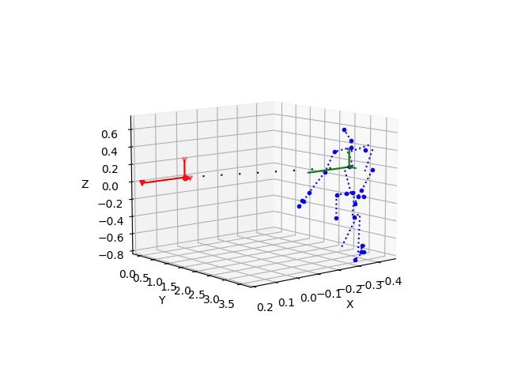

# Visualization/Plot of NTU-RGB Skeleton with Python    

This project provides tools to visualize the skeleton data from the NTU_RGB+D dataset using Python. While the dataset authors provided MATLAB code for visualization, this repository offers an alternative Python-based implementation. Existing online solutions were either non-functional or lacked proper documentation, prompting the development of this repository.

## Installation
To use this repository, follow these steps:

1. Install the required dependencies:
   ```sh
   pip install -r requirements.txt
   ```

   
2. Download and install FFmpeg to enable video saving. It is easy to install and works reliably across platforms. You can find it [here](https://ffmpeg.org/download.html)


## Usage
Refer to `getting_started.ipynb` for a quick introduction. All functions are documented for ease of use.  

It is recommended to save visualizations as videos, as `matplotlib.animation` may not work reliably in some Jupyter environments (such as VS Code). Videos are stored in the `videos/` folder.

### Example Output:
Pre-generated examples are available in the `videos/` folder. Below is a sample expected output:



## Acknowledgments
If you find this repository useful, please consider starring it. The original repository that inspired this project can be found [here](https://github.com/gardiens/Time-Series-Library_babygarches).

Special thanks to the [Rose Lab](https://rose1.ntu.edu.sg/dataset/actionRecognition/) for providing the NTU_RGB+D dataset, which enables research on this challenging problem.
